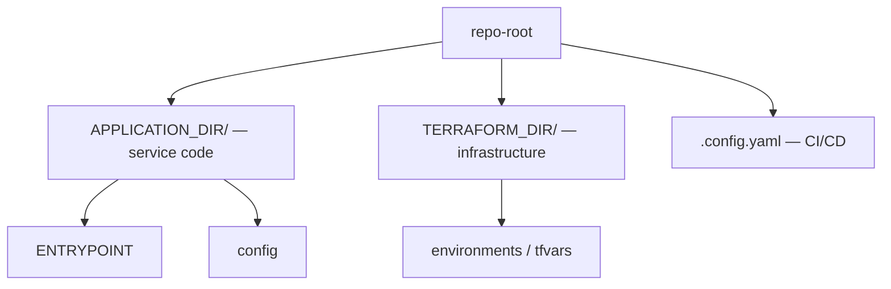
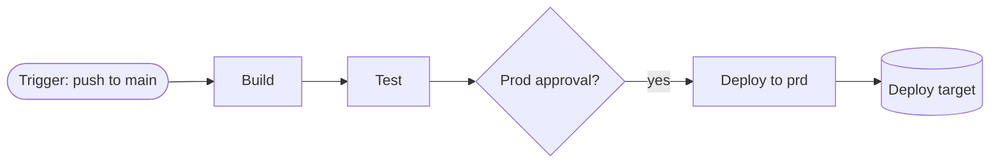
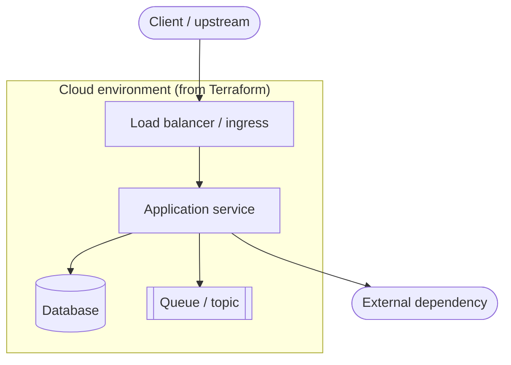
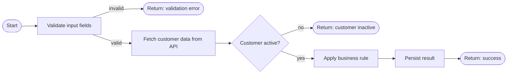

# Diagram Patterns

Ready-to-adapt Mermaid snippets for the three required diagrams. Adapt names to
the real repo; keep them legible (group, don't dump every file).

## 1. Repository structure

Use a `graph TD` to show top-level layout and the role of each anchor.

## 2. CI/CD pipeline

Use a `flowchart LR` following the stage order in .config.yaml. Show the trigger
on the left and the deploy target on the right. Mark approval gates.

## 3. Architecture / deployment

Use a `flowchart TB` mapping the application onto the Terraform-provisioned
infrastructure. Show the compute that runs the app, its data stores, and external
dependencies. Use a subgraph for the cloud/cluster boundary.

## 4. Business Logic / Business Rules

Use a `flowchart LR` to show the functional behavior of the application as
visible in the source code — not the infrastructure, not the deployment, but
what the code *does* step by step from a business perspective.

Read the application source (handlers, services, use cases, domain logic) and
trace the main processing path. Represent each meaningful business action as a
node. Keep it functional: name nodes after what happens, not which class or
method does it.

**Rules for building this diagram:**

- Derive every node from what you actually read in the source — do not invent steps.
- Use `[Action]` for processing steps, `{Question?}` for decisions, and `([Event])` for start/end/outcomes.
- Label every branch on a decision node (`|yes|`, `|no|`, `|invalid|`, etc.).
- One diagram per main flow. If the service has clearly distinct flows (e.g. one
  for each segment: OP, CLT, INSS), produce one diagram per flow and title each
  with the flow name.
- Stop at the level of business meaning. "Validate fields X, Y, Z" is one node —
  not three. "Call payment API" is one node — not the HTTP setup inside it.
- If a step is segment-specific, annotate the node: `[Validate margin -- INSS only]`.

## Conventions

- Direction: `TD` for structure, `LR` for pipelines, `TB` for architecture.
- Name nodes with real names from the repo, not generic labels.
- Prefer `[(...)]` for data stores, `[[...]]` for queues, `([...])` for actors/triggers.
- If a section can't be determined from the repo, omit those nodes rather than guessing.
