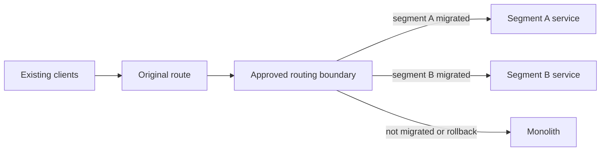

# Example - Decomposition by Segment

This is a format example, not a business definition.

## Proposed boundary record

| Field | Example placeholder |
|---|---|
| Requested axis | `<segment>` |
| Candidate context | `<segment-a-capability>` |
| Evidenced purpose | `<statement from approved source>` |
| Owned decisions | `<rules supported by EVD IDs>` |
| Owned data | `<authority supported by EVD IDs>` |
| Cross-segment behavior | `<known behavior or GAP ID>` |
| Evidence | `<EVD-001, EVD-002>` |
| Approval | `<pending approver>` |

## Required decision

If the same rule appears in more than one segment, determine from corporate
evidence whether it is:

- genuinely shared behavior with one owner;
- duplicated behavior that may diverge;
- superficially similar behavior with different meanings.

Until that decision is approved, keep it as a gap rather than creating a shared
service.

## Transition format example

When the segment is available through an approved trusted routing attribute, a
strangler transition may preserve the original route:

This diagram is only a proposal format. The actual segment classifier, routing
technology, fallback, and service boundaries require corporate evidence and user
approval.
