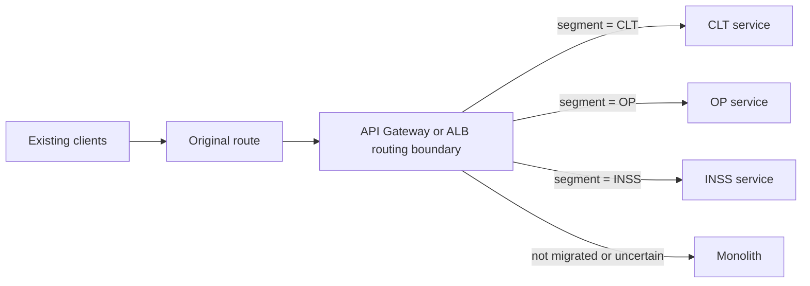

# Monolith-to-Microservices Transition Patterns

## Selection rule

Recommend a transition pattern only after confirming current hosting, routing,
contracts, traffic classification, state, data ownership, security, availability,
and rollback constraints. Treat every recommendation as a design proposal until
approved.

## Strangler transition

Preserve the existing external contract while a routing layer sends approved
slices to extracted services and leaves remaining behavior in the monolith.

Use when:

- routes or clients must remain stable;
- traffic can be classified reliably;
- incremental cutover and rollback are required.

Required controls:

- explicit routing precedence and fallback;
- no ambiguous or conflicting classification;
- contract, authorization, and error-semantic compatibility;
- per-route and per-segment observability;
- controlled rollout, shadowing or comparison when approved;
- immediate rollback to the monolith.

## AWS segment-routing example

For an AWS-hosted system split by evidenced business segments such as CLT, OP, and
INSS, preserve the original request contract and classify the segment at an
approved routing boundary.

Possible routing choices:

- **API Gateway:** route by approved path, header, claim, or request attribute;
  useful when API policy, transformations, authorization, throttling, or staged
  deployments are required.
- **Application Load Balancer:** route by supported listener conditions such as
  host, path, header, method, source IP, or query string; useful for direct HTTP
  routing to supported targets.
- **Routing facade/service:** inspect business data when segment classification
  requires an approved lookup or rule that the gateway/load balancer cannot safely
  express.

Do not assume an ALB can derive a segment hidden inside an arbitrary request body.
If the segment is not available through a supported, trusted routing attribute,
propose an API contract adjustment or routing facade and obtain approval.

## Other transition patterns

- **Branch by abstraction:** introduce an internal interface and switch
  implementations gradually when behavior cannot yet be routed externally.
- **Parallel run/shadowing:** execute old and new paths for comparison without
  duplicating externally visible effects.
- **Event interception:** move asynchronous behavior by changing event ownership and
  consumers with compatibility and replay controls.
- **Data-first transition:** establish data ownership and replication before
  behavior cutover when shared-state coupling is the principal blocker.

## Transition plan requirements

Every recommendation must define:

- preserved routes and contracts;
- classification and routing rule;
- migration unit and order;
- data ownership and synchronization;
- characterization, contract, and regression tests;
- observability and comparison signals;
- failure behavior and rollback;
- criteria for removing the monolith path.
