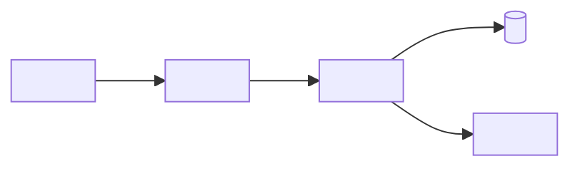
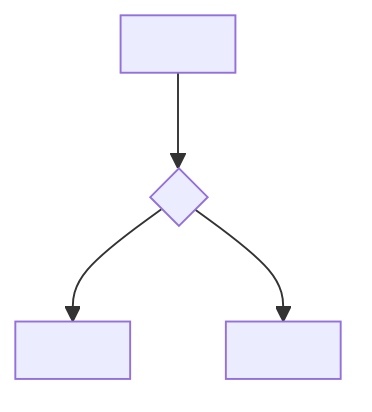
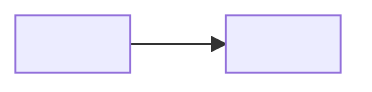
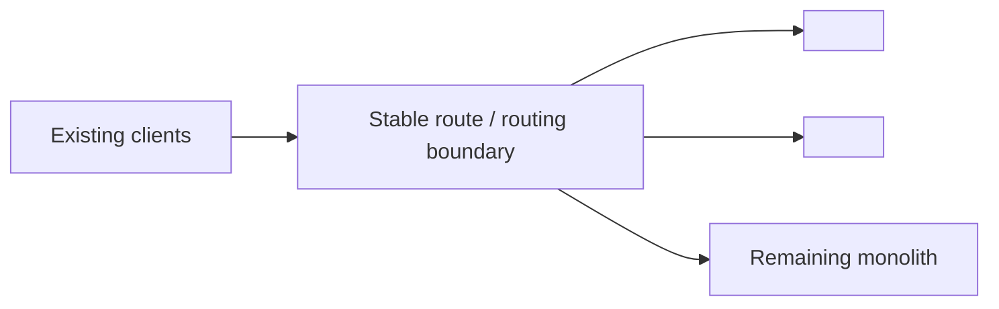
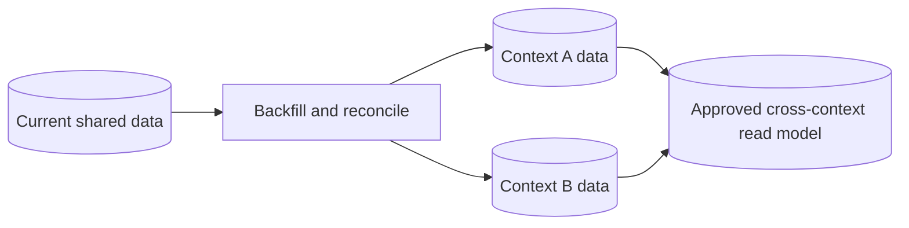
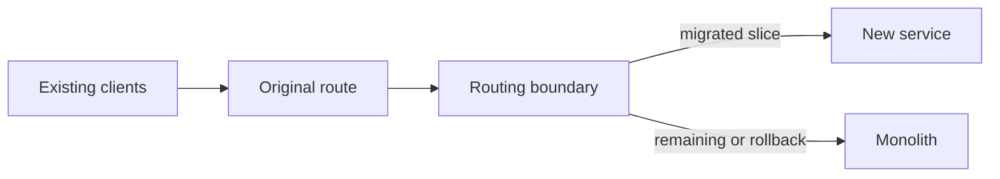

# Monolith Decomposition Proposal

## Mode, objective, and evidence

- Mode: `propose`
- Objective:
- Requested decomposition axis:
- Scope and exclusions:
- Approved constraints:
- Evidence IDs:
- Open gaps:

## Executive recommendation

- Recommended boundaries:
- Recommended transition pattern:
- Recommended database strategy:
- Proposed migration order:
- Decisions required before operation:

## Current architecture

## Business logic flow

Show the evidenced journey, decisions, and terminal outcomes.

## Business rules

| Rule ID | Rule | Affected journey/context | Evidence IDs | Gaps |
|---|---|---|---|---|
| BR-001 | `<evidenced rule>` | `<scope>` | `<EVD IDs>` | `<GAP IDs>` |

```mermaid
flowchart LR
    Input[<Input/state>] --> Rule{BR-001: <rule>}
    Rule -->|satisfied| Allowed[<allowed outcome>]
    Rule -->|not satisfied| Rejected[<rejected outcome>]
```

## Domains and bounded contexts

| Domain/context | Classification | Evidenced purpose | Owned decisions/data | Vocabulary | Dependencies | Evidence/gaps |
|---|---|---|---|---|---|---|
| `<context>` | `<core/supporting/generic only if evidenced>` | `<purpose>` | `<ownership>` | `<terms>` | `<dependencies>` | `<EVD/GAP IDs>` |

## Boundary alternatives

| Alternative | Evidence-based advantages | Risks | Decision required |
|---|---|---|---|
| `<alternative>` | `<advantages>` | `<risks>` | `<approver/question>` |

## Proposed target architecture

| Proposed service | Context/capability | Owned data | Contracts | Evidence/proposal IDs | Approval |
|---|---|---|---|---|---|
| `<service>` | `<scope>` | `<data>` | `<contracts>` | `<EVD/PROP IDs>` | `<pending>` |

## Database split strategy

### Current ownership and coupling

| Data set | Current owner | Consumers | Transactions/coupling | Evidence IDs |
|---|---|---|---|---|
| `<data>` | `<owner>` | `<consumers>` | `<coupling>` | `<EVD IDs>` |

### Options and recommendation

| Option | Benefits | Risks | Transition needs | Decision |
|---|---|---|---|---|
| `<shared transition/schema split/database per service/read model>` | `<benefits>` | `<risks>` | `<needs>` | `<recommendation>` |

## Transition architecture

Describe the routing/classification rule, preserved contract, fallback, data
coexistence, observability, and rollback. Use
`references/transition-patterns.md`.

## Proposed extraction sequence

| Order | Slice | Preconditions | Tests | Routing/cutover | Validation | Rollback |
|---|---|---|---|---|---|---|
| 1 | `<slice>` | `<conditions>` | `<tests>` | `<routing>` | `<criteria>` | `<procedure>` |

## Test and observability strategy

- Characterization and regression tests:
- Contract tests:
- Data migration and reconciliation tests:
- Per-route/context metrics and traces:
- Business outcome comparison:
- Alerting and rollback signals:

## Risks, gaps, and required decisions

| ID | Type | Description | Impact | Owner/approver | Required before |
|---|---|---|---|---|---|
| `<GAP/RISK/PROP>` | `<type>` | `<description>` | `<impact>` | `<owner>` | `<phase>` |

## Operation handoff

List the exact approvals, sources, target repositories, implementation constraints,
and first migration slice required to switch from `propose` to `operate` mode.
